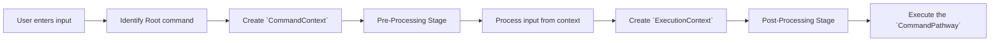

# Execution Flow
In this section, we will explore the execution flow of commands in Imperat, understanding how the
framework processes and executes commands based on user input.

This diagram illustrates the execution flow when a user inputs a command.

In short, Imperat starts by resolving the root command and building a `CommandContext` from the raw input.
The pre-processing stage prepares and validates data before pathway resolution chooses the best `CommandPathway`.
After that, an `ExecutionContext` is created, post-processing finalizes execution state, and the selected pathway is executed.

:::info{label="`CommandContext` vs `ExecutionContext`"}
`CommandContext` is created early and represents the raw input and the command-source.

`ExecutionContext` is created later by two steps:
- First, the `CommandPathway` is selected based on the `CommandContext`.
- Then, the arguments values are loaded and deduced, and the `ExecutionContext` is created with all the necessary information for executing the command.
:::
