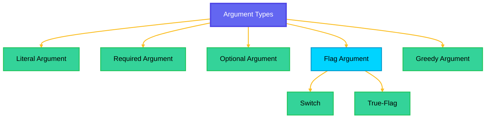
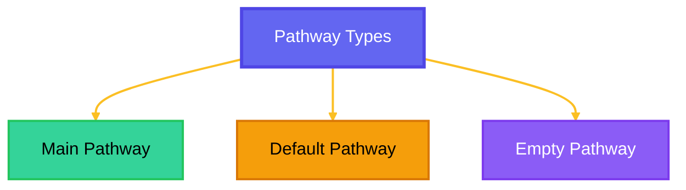

# Basic Definitions
Before diving into the details of Imperat, it's essential to understand some basic definitions that will help you grasp the concepts and terminology used throughout the documentation.
Understanding these basic definitions will help you navigate through the Imperat documentation and effectively utilize the framework to build powerful command hierarchies for your applications.

## Placeholders
You might often see names like `PLATFORMSOURCE`, `PLATFORMIMPERAT` in the documentation,
They refer to the specific implementations of Imperat for different platforms (e.g., Bukkit, Sponge, etc.).
`PLATFORMSOURCE` represents the source/sender of a command for that platform.
`PLATFORMIMPERAT` refers to the Imperat instance for that platform.

## Command 
A Command is a fundamental unit of functionality in Imperat. It represents an action that can be executed by the user.
 Commands can have subcommands, arguments, and various properties represented as pathways with certain characteristics that define the behavior of the command.

### Root Command
Root Command is the top-level Command in a command hierarchy. It serves as the entry point for executing commands and can have multiple subcommands and pathways.
Its the apex command that all other commands branch out from, and it often represents the main functionality or purpose of the command system, meaning they have no parent command and are the starting point for command execution.
 Root commands can have multiple subcommands and pathways, allowing for a flexible and organized command structure. They are essential for defining the overall structure and functionality of a command system in Imperat.

### Subcommand
A Subcommand is a Command that is nested within another Command, known as the parent Command.
Subcommands allow for a hierarchical structure of commands, enabling more complex and organized command systems.
Subcommands can have their own arguments and properties, and they can be executed independently of their parent Command. They are often used to group related commands together and provide a more intuitive command structure for users.

## Argument
An Argument is a parameter that a `Command` can accept. 
It provides additional information or input required for the Command to execute properly. Arguments can be of various types, such as strings, numbers, or custom objects, and they can have specific validation rules.

Arguments are classified into four types based on their position and requirements:
- **Literal Argument**: A fixed value that must be provided for the Command to execute. It is often used to define specific subcommands or options.
- **Required Argument**: An argument that must be provided by the user for the Command to execute. It is essential for the Command's functionality and cannot be omitted.
- **Optional Argument**: An argument that can be provided by the user but is not mandatory for the Command to execute. It allows for more flexible command usage and can have default values if not provided.
- **Flag Argument**: A special type of argument that represents a certain option or setting , this option can be represented as boolean for on/off toggling states **(Switch)** or it can be represented as a value that can be set **(True-Flag)**, 
it is often used to modify the behavior of a Command without requiring additional input.
- **Greedy Argument**: An argument that captures all remaining input from the user. It is often used for commands that require a variable number of arguments or for commands that need to capture a large amount of input.

:::tip 
Flags can be entered in any order, regardless of their position in the command, allowing users to customize command execution without worrying about argument placement.
:::

<Admonition type="custom" sideColor="#00d4ff" bgColor="#00d4ff20" title="PRO-TIP" icon="LightBulb">

Flags are classified into two types:
- **Switch**: A boolean flag that can be toggled on or off. It is often used to enable or disable certain features or options in a Command.
- **True-Flag**: A flag that can be set to a specific value. It is often used to provide additional information or settings for a Command that require a specific value rather than just an on/off state.
The value of a True-Flag can be of various types, such as strings, numbers, or custom objects, depending on the requirements of the Command.

</Admonition>

## Pathway
A Pathway is a structured representation of a Command's hierarchy and its associated properties.
It represents a specific way to execute a Command, including the required arguments, optional arguments, flags, and other metadata that define how the Command should be executed.
It defines how commands are organized and how they relate to each other.

A Command can have multiple Pathways, allowing for flexible command structures and various ways to execute the same command with different parameters sequences.
There are three types of Pathways:

### Main Pathway
The main pathway that represents the default way to execute a Command, it is the most commonly used pathway and is often the simplest one. 
However, it's a must for this pathway to start with a required argument, otherwise it will be considered as a default pathway.

### Default Pathway
The  The default pathway is a special type of pathway that is used when no other pathways match the user's input. 
It is often used as a fallback option and can be defined without the need to start with required arguments, 
Its a must to have the first arg as an optional or without any arguments. 
It can be used to provide a default behavior for a Command when no specific pathway is matched.

### Empty Pathway
The empty pathway represents a Command that can be executed without any additional input, its always empty and doesn't declare any possible arguments.
It's similar to the default pathway but it doesn't allow any arguments, it's only used internally.

## Context
Context is an object that holds information about the current state of command operation (e.g: execution, parsing, suggestion, etc). 
It provides access to various properties and methods that allow you to interact with the command system and manage the flow of command execution.
It allows you to access the arguments provided by the user, manage the execution flow, access the source/sender of the command, and send responses back to the user.

It has two main types:
- **Execution Context**: This context is used during the execution of a Command.
- **Suggestion Context**: This context is used during the suggestion phase when the user is typing a command and needs suggestions for possible completions.

Each type of context provides specific properties and methods relevant to its purpose, allowing you to effectively manage command execution and provide a seamless user experience when interacting with the command system in Imperat.

## ImperatConfig
ImperatConfig is the class designed to hold all customizable features of the framework, allowing users to customize the behaviour of the features provided.
